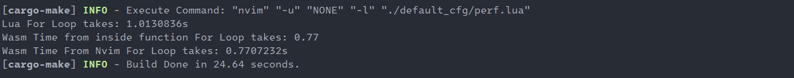

# <u>:fire:WASM_NVIM:zap:</u>

## Aim:

Write a library to interface between Lua, and wasm, for enabling communication between plugins and the Neovim apis. The library language is Rust, as it is to be dynamically loaded via lua, using the neovim api, instead of going via the rpc route which creates a networking bottleneck between two or more different process, this route allows for a single process **(NEOVIM)** , while also a plugin ecosystem that allows any programming language that can compile to wasm.

## Performance:

There is a poor mans performance test implementation, that imitates [Bram's implementation](https://github.com/vim/vim/blob/master/README_VIM9.md) of just summing a number inside a for loop, more will be done later, but as it appears now, wasm is faster than luajit atleast on my Windows 10 machine as you can see from the results:


Wasm version is atleast 30% faster than luajit/neovim version, if you compile for full optimisation for example in rust, you can get even 90% boost as seen in the image.
To run this test simply run the bellow:

```sh
cargo make perf
```

Requires:

- `cargo-make` which can be installed by `cargo install cargo-make` .
- `zig` to be in system path, can be installed from [Download ⚡ Zig Programming Language (ziglang.org)](https://ziglang.org/download/)

**NOTE: Current test only runs on Windows 10. That's the machine I have.**

## READING:

 - [Wasm memory allocation and dealocation](https://radu-matei.com/blog/practical-guide-to-wasm-memory/)


## Theory

We would need an allocation and deallocation function implementation on every wasm module, that the developers of it would need to create for themselves as data between the host **(this rust library)** and the wasm plugin can only currently be shared using i32 or f32, directly, but other objects like buffers, structs, etc, need more than just 32bits therefore we communicate using pointers to memory to the module to access and manipulate the data from the host side, where applicable, and normally this involves json.

## Installing and Setting up from release packages

```lua
-- for downloading shared librar from releases do this
-- if you don't want to build from source and just get
-- going. Warning, only supports, windows, linux, and macos
require("wasm_nvim_dl").download("windows")
-- Replace "windows" with either "linux", or "macos" for respective OS.

-- load wasm_nvim
local wasm = require("wasm_nvim")

-- this next line scan and load .wasm files into space
-- should be called only once, preferebly on your init.lua
wasm.setup {
  --debug = true -- uncomment to see debug info printed out, good for debugging issues.
}

-- Here tests is a wasm file, test.wasm inside a ./wasm folder
-- located in neovim runtimepath.
-- The luaExecExample is an example of a function exposed by the test.wasm module.
wasm.tests.luaExecExample();


```

## Building from source

```sh
cargo make build
```

Then move the shared library from /target/release/*.so or *.dll to a `./lua` folder on the neovim runtime path so as to use it.

### Requirements:

- Cargo Make `cargo make install`

## Required by Module

- a function called `functionality` that is exposed/exported so that it can be called from `wasm_nvim` library. The function returns a json defining what functions are exported, and what they take as parameters, also what they return. 

  ### An example:

  ```zig
  export fn functionality() u32 {
      var functions = ArrayList(Functionality).init(aloc);
      _ = functions.append(CreateFunctionality("hi", "void", "void")) catch undefined;
      var stringified = ArrayList(u8).init(aloc);
      json.stringify(functions.items, .{}, stringified.writer()) catch undefined;
      var unmanaged = stringified.moveToUnmanaged();
      // get id for setting a value
      const id = get_id();
      const addr = get_addr(&unmanaged.items[0]);
      //set the value to be consumed as a return type of this function
      set_value(id, addr, unmanaged.items.len);
      return id;
  }
  
  ```

  it returns an id, that maps to a json which was created by the `set_value()` function, which points to a json string that defines the functions and parameters exported by the module to be consumed. In this case the json would like like bellow:

  ```json
  [{"name":"hi", "params": "void", "returns": "void"}]
  ```

  - Params field: Can be `"void"` or anything else, doesn't really matter. When `"void"` means the function tagged by `"name"` consumes/accepts nothing.

  - Returns field: Same situation as Params field above, anything but void means the function returns something, else returns void.


    These fields are necessary when functions are being exported by wasm module, so that lua end that might call them has ability to get values if they are returned, or pass value to the function if it is expecting some.

## [Neovim APIs implementation with custom interface for more wasm juice](./API.md)

This section exists, because we currently can't directly interact with Neovim API's that require lua function as references or callbacks in parameters, so users might need to wrap their wasm callbacks into a lua function, and make the neovim api from that side as a solution for the time being.
NOTE: If you come across a neovim api that requires a lua function or callback in params, then make a `PR` to the [./API.MD](./API.md) file adding it to the list, or you can also create an `issue`.


## Exposed Useful Functions from Wasm_Nvim That can be consumed by modules.

### Examples Bellow use zig

- ```zig
  extern "host" get_id() u32;
  ```

  Get a unique `id` to be used for sharing data between wasm module and outside world.

- ```zig
  extern "host" get_addr(*u8) u32;
  ```

  Get the address from the host in terms of the memory of the module

- ```zig
  extern "host" get_value_addr(id: u32) [*]u8;
  ```

  Usable for getting location of value that was created from outside world of module. The value pointed here is to be managed by the module, and deallocated.
  **NOTE: value is cleared from memory of outside world once called, make sure to call before `get_value_size`, so as to know the length before calling this function**

- ```zig
  extern "host" get_value_size(id: u32) u32;
  ```

  Given an id to a value, it returns the size of the value located at given id. This should be called before `get_value_addr` as that would clear the id from memory.

  s

- ```zig
  extern "host" set_value(id: u32, loc: u32, size: u32) void;
  ```

  Used for returning/setting a value to the `wasm_nvim` library or to the outside world from the wasm module using it. Users of this method should make sure the relinquish memory control of any thing the pointer is pointing to.

- ```zig
  extern "host" lua_exec(id: u32) void;
  ```

  Executes lua script which is string, created, and passed to host via `get_id`  and`set_value` combination, the id of the string is then passed to this function which it will then be executed.

  **NOTE**: This prints out the loaded string to output on some neovim versions, eg: 0.9.1 on windows. 

- ```zig
  extern "host"lua_eval(id: u32) u32;
  ```

  Similar to `lua_exec` except that this one evaluates expressions and will return a value that is mapped to the id. The value returned will say `"null"`, if the expression evaluated returned nothing, otherwise the value would contain the contents of the results

  **NOTE**: This is for expressions, anything else passed to this function can result to undefined behavior

## [Tutorial](./TUTORIAL.md)